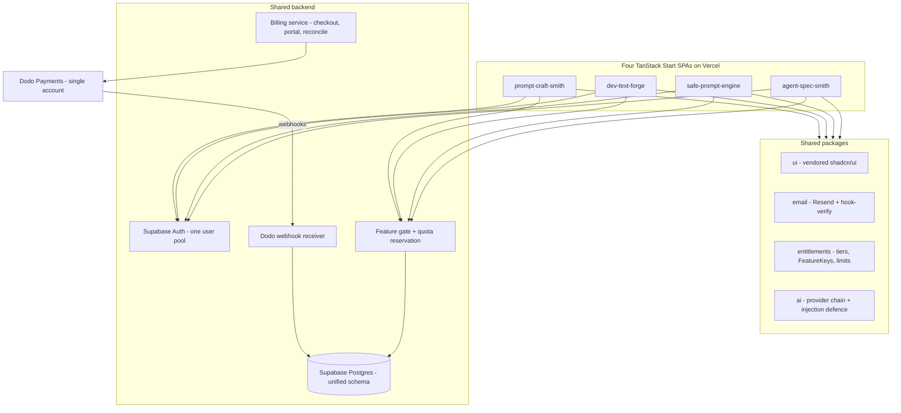

# Utilities Manager

Central hub for the **Utilities Applications** program: four developer-focused AI utilities being brought to production parity with DevSpeak — live, monetized, and architected for scale under aggressive developer-focused marketing.

This repository holds no application code. It is the index, the architectural decision record, and the operating manual that agents and contributors read before touching any of the four product repositories.

**Program goal:** consolidate the four utilities onto a **single shared backend** and a **single payment processor**, replacing today's four isolated Supabase projects and four unmonetized frontends.

---

## Table of Contents

- [Repository Index](#repository-index)
- [Current State Assessment](#current-state-assessment)
- [Target Architecture](#target-architecture)
- [Consolidation Roadmap](#consolidation-roadmap)
- [Reference Patterns to Port](#reference-patterns-to-port)
- [Known Blockers](#known-blockers)
- [Conventions](#conventions)

---

## Repository Index

### Utilities Applications (the four products)

| Repository                                                               | Product                                                                                                              | Live URL                        | Dev Port | Supabase Ref           |
| ------------------------------------------------------------------------ | -------------------------------------------------------------------------------------------------------------------- | ------------------------------- | -------- | ---------------------- |
| [agent-spec-smith](https://github.com/juanjaragavi/agent-spec-smith)     | Converts informal prompts into safety-gated task specifications for browser AI agents                                | `agent-spec-smith.vercel.app`   | 8080     | `cpsxbbnqonyofgspkxof` |
| [safe-prompt-engine](https://github.com/juanjaragavi/safe-prompt-engine) | Prompt Guardian — prompt-governance console with static scan → adversarial eval → regression → human-gated promotion | `safe-prompt-engine.vercel.app` | 8081     | `rqtcuzgeusnvuvpxznrt` |
| [dev-text-forge](https://github.com/juanjaragavi/dev-text-forge)         | Code & Development Text Optimizer — rewrites developer text to native-level technical English                        | `dev-text-forge.vercel.app`     | 8082     | `epuuexaprnmekbaidugg` |
| [prompt-craft-smith](https://github.com/juanjaragavi/prompt-craft-smith) | PromptForge — multi-tool prompt-engineering studio with a registry-driven tool grid                                  | `prompt-craft-smith.vercel.app` | 8083     | `mojgpzxmzkrtyzgvbnsz` |

All four are Vercel-linked under org `team_RrpJ5TUcF3sr0cNf4tsc1QhF`.

### Mature Reference Repositories

Use these as templates for billing, payment methods, architecture, design patterns, coding standards, and feature implementation.

| Repository                                                     | Role for this program                                                                                                                                                                  |
| -------------------------------------------------------------- | -------------------------------------------------------------------------------------------------------------------------------------------------------------------------------------- |
| [devspeak](https://github.com/juanjaragavi/devspeak)           | **Primary reference.** The only codebase in the portfolio with working payments, entitlements, quota metering, RBAC, AI-crawler SEO, i18n enforcement, and multi-channel distribution. |
| [talentassisto](https://github.com/juanjaragavi/talentassisto) | **Secondary reference.** Better i18n runtime model and test-config hygiene than DevSpeak. No payments — do not use it as a billing reference.                                          |

All six repositories are expected to be cloned as siblings of this one. Local checkout paths are kept in `lib/documents/notes.md`, which is intentionally untracked.

---

## Current State Assessment

### The four utilities share one scaffold

All four are the same Lovable-generated project (`"name": "tanstack_start_ts"` in every `package.json`), with identical pinned versions:

- TanStack Start `1.168.32` · TanStack Router `1.170.18` · React `19.2.0` · Vite 8 · Tailwind v4
- `@supabase/supabase-js@^2.112.3` · `zod@^3.24.2` · `resend@^6.22.0` · `context.dev@^2.12.0`
- Config delegated to `@lovable.dev/vite-tanstack-config@^2.15.0`, `rolldown` pinned to `1.2.1`

Server logic is exclusively **TanStack Start server functions** using the `*.server.ts` suffix convention. There are **no Supabase edge functions** in any of the four. Auth is Supabase Auth + Google OAuth with RLS scoped to `auth.uid()`.

Byte-identical or near-identical across all four — the high-value dedup targets:

- `src/components/ui/**` (vendored shadcn/ui, ~30 identical Radix pins)
- `src/lib/email/**` + `email.functions.ts` + the Web-Crypto `hook-verify.server.ts`
- `src/lib/context.server.ts` (Context.dev wrapper with 408/429 backoff)
- Settings module: `settings.functions.ts`, `preferences-store.server.ts`, `user-preferences.ts`, plus the `profiles` + `user_preferences` tables
- The `20260824103000_email_dispatch_ledger.sql` migration
- `scripts/` (`preview-email.mjs`, `send-test-email.mjs`, `upload-email-assets.sh`)
- `skills-lock.json` (identical `computedHash` values)
- The error trio: `error-capture.ts`, `lovable-error-reporting.ts`, `error-page.ts`

### What is missing in all four

| Gap                       | Status                                                                                                                                                                                               |
| ------------------------- | ---------------------------------------------------------------------------------------------------------------------------------------------------------------------------------------------------- |
| **Payments**              | No provider anywhere. No Stripe/Dodo/Paddle/Lemon dependency in any repo.                                                                                                                            |
| **Enforced entitlements** | None. See breakdown below.                                                                                                                                                                           |
| **CI**                    | ~~None.~~ **Phase 0 added `ci.yml` to all four** (lint → typecheck → test → build). `agent-spec-smith` also has `keep-supabase-warm.yml`, a cron keeping the four Supabase free-tier projects alive. |
| **Tests**                 | Only `prompt-craft-smith` has any — **85 tests across 12 files, now gated in CI**. The other three have no runner.                                                                                   |
| **`typecheck` script**    | ~~Absent in all four.~~ **Added to all four in Phase 0.** Hard gate in three; ratcheted in `prompt-craft-smith`.                                                                                     |
| **i18n**                  | Absent in all four. All UI strings are hardcoded English. Violates the standing localization rule.                                                                                                   |
| **Observability**         | No Sentry, no PostHog, no analytics.                                                                                                                                                                 |
| **SEO for AI crawlers**   | These are client-rendered SPAs. AI crawlers execute no JavaScript, so today they see an empty page.                                                                                                  |

### Entitlement scaffolding, ranked

1. **`prompt-craft-smith` — the only viable foundation.** Server-side `usage_events` table, `FREE_LIMITS = { ai_run: 25, matrix_run: 10, version: 10 }` in `src/lib/usage.ts`, and a `cost_usd numeric` column on `test_runs`. Metering is real; enforcement is not yet wired.
2. **`agent-spec-smith` — discard.** `src/lib/spec-review-usage.ts` is a **localStorage** counter (`FREE_MONTHLY_REVIEWS = 3`). Its own header comment states it must not be treated as a security boundary. Cleared by wiping browser storage.
3. **`dev-text-forge`, `safe-prompt-engine` — nothing.** No metering surface at all.

### Divergences that must be reconciled

| Dimension                       | agent-spec-smith                       | safe-prompt-engine                      | dev-text-forge                      | prompt-craft-smith                  |
| ------------------------------- | -------------------------------------- | --------------------------------------- | ----------------------------------- | ----------------------------------- |
| Lockfiles                       | `package-lock` + bunfig                | `package-lock` + bunfig                 | **`bun.lock` + `package-lock`**     | `package-lock` + bunfig             |
| AGENTS.md package manager claim | bun                                    | npm (correct)                           | **npm (wrong — `bun.lock` exists)** | mixed bun/npm                       |
| AI module name                  | `llm-providers.server.ts`              | `gateway.server.ts`                     | `ai.server.ts`                      | `ai-gateway.server.ts`              |
| AI SDK                          | `@ai-sdk/anthropic` + `openai`, `ai@7` | `@anthropic-ai/sdk`, `openai@7`         | bare `openai@4`                     | `@ai-sdk/openai-compatible`, `ai@7` |
| Validation                      | Zod                                    | **hand-rolled (Zod installed, unused)** | Zod                                 | Zod                                 |
| Migrations                      | 3                                      | **10**                                  | 6                                   | 6                                   |
| `updated_at` trigger fn         | `update_updated_at_column()`           | `set_updated_at()`                      | `set_updated_at()`                  | `set_updated_at()`                  |
| Route layout                    | `_authenticated/`                      | `_authenticated/`                       | flat                                | flat + `$toolId`                    |
| `src/lib` suffixes              | 3-suffix                               | **4-suffix (`-core`, `-browser`)**      | 3-suffix                            | 3-suffix                            |
| `src/lib` entries               | 50                                     | 37                                      | 26                                  | 47 (+12 tests)                      |

Provider chain is consistent in intent across all four — **DeepSeek → Anthropic → Nvidia → Lovable Gateway** — and all API keys are read server-side via `process.env`. **No client-exposed AI secrets.** Only `VITE_SUPABASE_*` and `VITE_SITE_URL` are client-baked, which is correct.

`agent-spec-smith` additionally runs a second database — Neon serverless (`AgentSpecSmith_DATABASE_URL`) holding a `spec_generation_events` table — deliberately kept off Supabase for anonymous ops metrics.

### DevSpeak, for contrast

DevSpeak is **not Next.js** (a common misassumption). It is Vite 8 + React 19 + React Router 8 SPA with a separate **Express 5** backend bundled into Vercel serverless functions, managed as a pnpm 11 + Turborepo monorepo on **Firestore** (no Supabase).

What it has that the utilities do not:

- **Dodo Payments** (Merchant of Record) with Standard Webhooks signature verification, atomic idempotency, event-priority staleness guards, and a transactional multi-collection write
- Four tiers — `FREE` / `VIBECODER` ($9.99) / `DEVELOPER` ($19.99) / `ENTERPRISE` — gating 11 typed `FeatureKey`s
- Three-layer entitlement resolution (subscription snapshot → plan document → static fallback) with `BILLING_PLAN_VERSION` snapshot invalidation
- Transactional quota reservation for calls, bytes, and managed tokens
- Firestore rules that make client-side self-upgrade structurally impossible
- Zod-based env schema validation wired into `prebuild`, so bad config fails the build rather than the first live request
- Server-rendered AI-crawler snapshots, dynamic sitemap, `llms.txt`, RSS, IndexNow
- i18next with EN/ES parity **enforced in CI**, including a hardcoded-string scanner
- Five distribution channels: VS Code extension, npm CLI, MCP server, macOS app, public REST API

---

## Target Architecture

### Decisions

| Decision                        | Choice                                            | Rationale                                                                                                                                                   |
| ------------------------------- | ------------------------------------------------- | ----------------------------------------------------------------------------------------------------------------------------------------------------------- |
| **Backend**                     | One shared backend serving all four frontends     | Four Supabase projects means four auth pools, four RLS surfaces, four keep-warm crons, and no cross-sell. A user who pays once must be entitled everywhere. |
| **Payment processor**           | **Dodo Payments**, single account                 | Already live and audited in DevSpeak. Merchant of Record handles global tax. Porting a proven integration beats building a second one.                      |
| **Datastore**                   | Supabase Postgres (single project)                | All four already run Supabase Auth + RLS. Migrating four apps to Firestore is a rewrite; porting DevSpeak's billing _logic_ to Postgres is not.             |
| **Entitlement source of truth** | Server-side, RLS-protected, never client-writable | Mirror DevSpeak's `hasProtectedSubscriptionTierWrite` guarantee as Postgres RLS + column grants.                                                            |
| **Metering foundation**         | `prompt-craft-smith`'s `usage_events`             | The only server-side meter in the portfolio. Generalize it with an `app` discriminator.                                                                     |
| **Frontend**                    | Keep four separate TanStack Start deployments     | Independently marketable products with distinct SEO surfaces. Share code via an extracted package, not a merged app.                                        |

### Shape

### Unified schema direction

One `documents` table discriminated by `source_tool` (the column `prompt-craft-smith` already has), replacing four incompatible definitions:

| Repo               | Today's `documents` shape                                                             |
| ------------------ | ------------------------------------------------------------------------------------- |
| agent-spec-smith   | `title`, `content`                                                                    |
| prompt-craft-smith | `title`, `content`, `source_tool`                                                     |
| dev-text-forge     | `title`, `mode`, `model`, `input_text`, `output_text`, `gate_status`, `gate_findings` |
| safe-prompt-engine | separate `prompts` table instead                                                      |

App-specific tables (`spec_jobs`, `test_suites`, `regression_cases`, `refinement_runs`, …) stay distinct but move into the single project under one `user_id` namespace.

---

## Consolidation Roadmap

Ordered by dependency. Each phase gates the next.

### Phase 0 — Safety net (blocking)

Nothing below is safe without this. A merge touching auth, RLS, and a unified `documents` table currently has essentially zero automated verification.

**Status: all 6 items complete and pushed.** ⚠️ But the CI workflows **cannot start** — GitHub Actions returns `startup_failure` in all four repos for an account-level reason, so the lint/typecheck/test gates are not enforcing yet. The env validator _is_ live, because it runs inside the Vercel build rather than in Actions. See [Phase 0 execution log](#phase-0-execution-log).

- [x] Add `typecheck` (`tsc --noEmit`) script to all four
- [x] Add `test` script; promote `prompt-craft-smith`'s Vitest files into a gated suite — **85 tests across 12 files, all passing**
- [x] Add a shared CI workflow: lint → typecheck → test → build, no path filter
- [x] Resolve the lockfile conflict — **bun is canonical**; `package-lock.json` deleted in all four, every `AGENTS.md` corrected
- [x] Audit `prompt-craft-smith/.env.backup-lovable` — **live secrets found in pushed history; rotation deferred by owner**
- [x] Port DevSpeak's Zod env validator (`src/env.ts` + `src/validate-env.ts`) into `prebuild` for all four

#### Phase 0 execution log

**Package manager: bun.** Decided 2026-09-17. `bun install` generated `bun.lock` in all four; the stale `package-lock.json` was removed from each. `dev-text-forge` had carried both. Note the local `bun` on `PATH` (`~/Library/pnpm/bun`) is a broken pnpm shim that exits 0 silently — the real binary is `~/.bun/bin/bun` (1.2.7).

**Typecheck baseline**, measured after a fresh `bun install` in each repo (`node_modules` was absent in all four):

| Repo                 | Type errors before | After | Gate                    |
| -------------------- | ------------------ | ----- | ----------------------- |
| `agent-spec-smith`   | 1                  | **0** | hard                    |
| `safe-prompt-engine` | 0                  | **0** | hard                    |
| `dev-text-forge`     | 0                  | **0** | hard                    |
| `prompt-craft-smith` | 131                | 131   | **ratchet** (see below) |

`agent-spec-smith`'s single error was fixed in `src/lib/task-spec-policy.ts` — `PolicyFinding.id` became `string | undefined`, matching the convention its own `AGENTS.md` documents for `exactOptionalPropertyTypes`.

`prompt-craft-smith`'s 131 errors are **not** 131 bugs: 107 are `TS4111` from `noPropertyAccessFromIndexSignature`, a mechanical `obj.key` → `obj["key"]` rewrite, concentrated in `LocalTools.tsx` (61) and `workspace-data.test.ts` (33). A hard gate would block every PR, so CI compares against `.tsc-baseline` and fails only if the count **rises**. Lower the baseline as errors are fixed.

**CI** is `.github/workflows/ci.yml` in each repo: `bun install --frozen-lockfile` → lint → typecheck → test (where it exists) → build, on push to `main` and every PR, no path filter, `cancel-in-progress` concurrency. Every step was verified locally with bun in all four repos before commit; all pass.

`bun-version` is deliberately `latest`, not pinned. Vercel builds these repos with its own current bun — **1.3.14** as of 2026-09-17 — and its build log says `Saved lockfile`, meaning it rewrote the lockfile a local bun 1.2.7 produced. Pinning CI below production would let a lockfile pass CI and then get rewritten in production, which is exactly the drift `--frozen-lockfile` exists to catch.

**Vercel deploys confirm the lockfile switch works.** All four rebuilt and reached `Ready` on the Phase 0 commits; Vercel auto-detects bun from `bun.lock` with no config change, so removing `package-lock.json` did not disturb deployment.

**GitHub Actions cannot start in these repos.** Every CI run returns `startup_failure` with `path: "BuildFailed"`. This is **not** a defect in the Phase 0 workflows:

- `actions/checkout@v5` and `oven-sh/setup-bun@v2` both exist; the YAML parses and contains no tabs
- GitHub **registers the workflow as `state: "active"`** via the API, so the file itself is valid server-side
- Actions is enabled with `allowed_actions: "all"` and no SHA-pinning requirement
- `agent-spec-smith` already had a `startup_failure` on 2026-09-16 against the **previous** SHA `682248a`, before any Phase 0 change existed
- An 8-line no-op workflow (`runs-on: ubuntu-latest`, `run: echo ok`), pushed and dispatched manually, also returned `startup_failure`
- The failing check-suite reports **0 jobs created** and no check-runs — the run never reaches a runner
- **Decisive:** `devspeak` and `talentassisto` fail identically. `devspeak`'s **last 100 runs are all `startup_failure`**, across workflows that worked for months and have nothing to do with this program.

The failure is **account-wide and predates Phase 0**. It is not a defect in these workflows. Most likely an Actions spending limit or a billing/payment issue on the personal account (`juanjaragavi`, type `User`, all repos private). The billing API needs a `user` OAuth scope the local `gh` token lacks, so it could not be confirmed from here. Check <https://github.com/settings/billing>.

**Consequence:** the CI gates are committed and every step passes locally and on Vercel, but **no gate is actually enforcing yet.** Phase 0's safety net is not live until Actions runs.

**Env validation** is `src/env.ts` + `src/validate-env.ts` in each repo, wired into `prebuild`. **Confirmed running in production** — the Vercel build log shows `bun run validate-env` → `Environment configuration OK`.

Three decisions worth carrying into later phases:

- **Blank-string normalization is the point.** Vercel stores a defined-but-empty variable as `""`, which a plain `.optional()` accepts and hands to a client expecting a real value. Every optional field preprocesses `""` → `undefined` first. Verified: blanking `SUPABASE_URL` exits 1 in all four.
- **No new dependencies.** bun runs the TypeScript directly and loads `.env` natively, so neither `tsx` nor `dotenv` was added. Confirmed beforehand that bun honours the `prebuild` lifecycle hook — without that the validator would have silently never run.
- **Only startup-critical vars are required.** AI provider keys stay optional because each repo's provider chain falls through and surfaces a friendly runtime error; requiring them would break local builds for no safety gain.

`prompt-craft-smith` already had `src/lib/env.server.ts`, a **runtime** loader that merges `.env` into `process.env` during `vite dev`. It does not validate, so the new build-time schema is additive; both files note the distinction.

**Still open:** the Actions billing question (Blocker #10) and the deferred key rotation (Blocker #9).

### Phase 1 — Schema convergence

- [ ] Squash `safe-prompt-engine`'s 10 migrations (8 dated the same day)
- [ ] Standardize the `updated_at` trigger on one name across all four
- [ ] Design the unified `documents` + `document_versions` schema with `source_tool` as discriminator
- [ ] Stand up the single Supabase project; write the migration and a reversible data-migration plan
- [ ] Generalize `usage_events` with an `app` column; keep `cost_usd` accounting

### Phase 2 — Auth unification

- [ ] Single Supabase Auth pool; plan user-identity merge across four existing pools
- [ ] Re-derive all RLS policies against the unified schema
- [ ] Retire the four-project `keep-supabase-warm.yml` cron (one paid project, no free-tier pausing)

### Phase 3 — Payments

Port from DevSpeak, retargeting Firestore to Postgres. Preserve the non-obvious controls verbatim.

- [ ] Single Dodo account; define the cross-app tier matrix and product IDs
- [ ] Billing tables: `billing_subscriptions`, `billing_webhook_events`, `billing_checkout_sessions`, `billing_audit_logs`, `billing_reconciliation_jobs`, `billing_plans`
- [ ] Webhook receiver — **raw body mounted before JSON parsing**, per-header 400s, 401 on bad signature, 500 on processing failure so Dodo retries
- [ ] Idempotency via atomic insert on `webhook-id` + event-priority staleness guard
- [ ] RLS + column grants making `subscription_tier` and all `billing_*` fields client-unwritable
- [ ] Three-layer plan resolution with a `BILLING_PLAN_VERSION` snapshot
- [ ] Transactional quota reservation; feature gate on the server, mirrored client-side from a `/me` endpoint
- [ ] Two-flag live gate (`BILLING_SYSTEM_STATUS` + `DODO_BILLING_ENABLED`) that throws at startup if misconfigured
- [ ] Port all 7 billing test files
- [ ] **Delete** `agent-spec-smith`'s localStorage counter

### Phase 4 — Shared packages

- [ ] Extract `ui` (shadcn/ui), `email` (Resend + hook-verify), `entitlements`, `ai` (provider chain + injection defence)
- [ ] Converge the four AI module names and SDK choices onto one
- [ ] Replace `safe-prompt-engine`'s hand-rolled validation with Zod

### Phase 5 — Marketing readiness

Required before aggressive developer-focused marketing. These are client-rendered SPAs; without Phase 5 the marketing spend lands on pages AI crawlers cannot read.

- [ ] Server-rendered crawler snapshots + Vercel Edge middleware UA rewrite (**not optional**)
- [ ] Dynamic sitemap, `llms.txt`, RSS, IndexNow, AI-allowlisted `robots.txt`
- [ ] `x-robots-tag: noindex` on preview deployments
- [ ] MDX content pipeline with answer-first `aiDescription` frontmatter
- [ ] Consent-gated GTM/GA4 with a typed event union and primitive-only payloads
- [ ] i18n runtime + locale parity CI + hardcoded-string scanner (satisfies the standing localization rule)
- [ ] Real exception capture — DevSpeak has none; do not inherit that gap

### Phase 6 — Scale and distribution

- [ ] Coverage thresholds (DevSpeak has none — set these from day one)
- [ ] Playwright with a real `playwright.config.ts`, not shell wrappers
- [ ] Post-deploy live smoke tests
- [ ] Rate limiting with accurate `Retry-After`; maintenance mode; request timeouts
- [ ] API keys (`dsk_live_`/`dsk_test_`, SHA-256 at rest, plaintext returned once) if any utility exposes a public API
- [ ] Evaluate CLI / MCP / VS Code distribution per DevSpeak's tag-driven release workflows

---

## Reference Patterns to Port

Ranked by leverage. Paths are relative to the reference repo.

### Tier 1 — port near-verbatim

| Concern                  | Source                                                      | Why it matters                                                                                                                                                                |
| ------------------------ | ----------------------------------------------------------- | ----------------------------------------------------------------------------------------------------------------------------------------------------------------------------- |
| Env validation           | `devspeak/src/env.ts`, `src/validate-env.ts`                | Vercel-specific preprocessors: blank-string → `undefined` so `.default()` applies, boolean coercion, fail-safe `test_mode` enum. Fails the build, not the first live request. |
| Webhook receipt          | `devspeak/src/server/routes/dodoWebhook.ts`                 | Raw-body mount order, per-header 400s, 401-vs-500 semantics, dedicated limiter above the global rate.                                                                         |
| Webhook idempotency      | `devspeak/src/server/services/payment/webhookProcessor.ts`  | Atomic-create dedup **plus** `EVENT_PRIORITY` staleness guard. Both are necessary; neither is obvious.                                                                        |
| Self-upgrade prevention  | `devspeak/firestore.rules`                                  | Translate `diff().affectedKeys()` guards into Postgres RLS + column grants. The single most important control.                                                                |
| Entitlement matrix       | `devspeak/src/config/entitlements.ts`                       | `Record<FeatureKey, true>` compile-time exhaustiveness; `-1` = unlimited; frozen objects. A hand-maintained predicate once silently dropped two features.                     |
| Plan resolution + quotas | `devspeak/src/server/services/payment/planAccessService.ts` | Snapshot → plan doc → static fallback; one unit-agnostic reservation transaction for calls/bytes/tokens.                                                                      |
| Log masking              | `devspeak/src/server/utils/safeLogger.ts`                   | Applied to every client-facing error and to raw webhook payloads before persistence.                                                                                          |

### Tier 2 — adopt the pattern, retarget storage

`dodoClient.ts` (lazy singleton + `resetForTesting` seam) · `billingService.ts` · `errors.ts` · `webhooks.ts` · `entitlementReconciler.ts` · `integrityService.ts` · the 4-endpoint billing route shape (checkout / subscription / portal / reconcile-behind-RBAC) · `pricingPlans.ts` `BillingWorkflowTarget` union · `featureGate.ts` + client entitlement store · `apiKey.ts` · `security.ts` (helmet, tiered limiters, `trust proxy 1`).

### Tier 3 — SEO and marketing

`devspeak/src/server/routes/seo.ts` · `devspeak/middleware.ts` · `src/shared/aiCrawlers.ts` · `scripts/content/generate-indices.ts` · `src/content/schema.ts` · `public/robots.txt` · `src/utils/analytics.ts` + `src/config/gtmContainer.ts`.

### Tier 4 — i18n, CI, testing

Prefer **talentassisto** for the i18n runtime: `i18nConfig.js` + `i18next-resources-to-backend` gives a single-source locale list, lazy per-locale chunks, and a static `defaultLocale` that avoids hydration mismatches. Take DevSpeak's cookie handling, `<html lang>` sync, and `i18next.d.ts` typing, and **all** of its enforcement tooling (`scripts/i18n/validate-locales.ts`, `scan-hardcoded-strings.ts`, `.github/workflows/i18n-audit.yml`).

Also: `devspeak/.github/workflows/web-ci.yml` · `scripts/sync-versions.mjs` · the tag-driven release workflows · `vercel.json` (`framework: null`, `includeFiles`, per-function `maxDuration`, security headers) · talentassisto's `.eslint-baseline` / `.tsc-baseline` / `.coverage-baseline` debt ratchets.

### Do not inherit these gaps

1. No coverage thresholds anywhere in DevSpeak — set them here from the start.
2. No error tracking (GA4 + `safeLogger` only) — add real exception capture.
3. E2E is shell-script-driven with no Playwright config.
4. `resolveBillingBaseUrl` falls back to `localhost:3000` — a latent "customer pays and lands nowhere" bug. Throw instead.
5. `ADMIN_AUTHORIZED_EMAILS` bootstrap is self-declared debt. Go RBAC-only.
6. Some billing collections rely on a catch-all deny rather than explicit blocks. Write explicit blocks.

---

## Known Blockers

| #   | Blocker                                             | Impact                                                                                                                                                                                                                                                                                                                                                                                                                                                                          |
| --- | --------------------------------------------------- | ------------------------------------------------------------------------------------------------------------------------------------------------------------------------------------------------------------------------------------------------------------------------------------------------------------------------------------------------------------------------------------------------------------------------------------------------------------------------------- |
| 1   | **Four separate Supabase projects**                 | Four auth pools. Consolidation means a user-identity merge, not just a schema merge.                                                                                                                                                                                                                                                                                                                                                                                            |
| 2   | **`documents` defined four incompatible ways**      | The single largest schema-merge task. `source_tool` is the natural discriminator.                                                                                                                                                                                                                                                                                                                                                                                               |
| 3   | **Trigger function name conflict**                  | `update_updated_at_column()` vs `set_updated_at()`. Pick one before squashing migrations.                                                                                                                                                                                                                                                                                                                                                                                       |
| 4   | **Billing must be built from scratch**              | No provider in any of the four. Only `prompt-craft-smith`'s `usage_events` is reusable.                                                                                                                                                                                                                                                                                                                                                                                         |
| 5   | **No test safety net** — partly addressed           | Phase 0 added CI to all four, `typecheck` everywhere, and gated 85 tests in `prompt-craft-smith`. **Nothing enforces yet — see #10.** Three repos still have no test runner.                                                                                                                                                                                                                                                                                                    |
| 6   | **i18n absent everywhere**                          | Greenfield workstream across four apps of hardcoded English.                                                                                                                                                                                                                                                                                                                                                                                                                    |
| 7   | **SPAs are invisible to AI crawlers**               | Blocks the marketing thesis until Phase 5 ships.                                                                                                                                                                                                                                                                                                                                                                                                                                |
| 8   | ~~**Lockfile drift**~~                              | **Resolved in Phase 0.** bun is canonical; `package-lock.json` removed from all four; every `AGENTS.md` corrected.                                                                                                                                                                                                                                                                                                                                                              |
| 9   | 🔴 **Leaked API keys in pushed history**            | `prompt-craft-smith@f992110` committed `.env.backup-lovable`. `ANTHROPIC_API_KEY`, `DEEPSEEK_API_KEY`, and `NVIDIA_API_KEY` are byte-identical to the live values today. Repo is private, so not a public leak. **Rotation deferred by owner.** Rotate before scrubbing history — scrubbing first leaves live keys in every existing clone.                                                                                                                                     |
| 10  | 🔴 **GitHub Actions will not start (account-wide)** | Every run returns `startup_failure` with 0 jobs created — in all four utilities **and** in `devspeak` and `talentassisto`. `devspeak`'s last 100 runs all failed, across workflows that worked for months. Predates Phase 0 and is unrelated to it. Workflows register as `active`, so the YAML is valid; cause is account-level, likely Actions billing. **Only the owner can fix this** — see <https://github.com/settings/billing>. Vercel deploys are unaffected and green. |

### Operational notes carried forward

- Dodo API keys carry no mode prefix — mode is determined by probing `live.` vs `test.dodopayments.com`.
- Store non-secret Vercel env vars with `--no-sensitive`, or `vercel env pull` returns `""` and makes an outage invisible.
- `vercel --prod` fails above ~15000 files — use `--archive=tgz`.
- Vercel Node runtime: `IncomingMessage.signal` is getter-only. Use `Object.defineProperty`, never direct assignment.
- `express-rate-limit` throws on Vercel without `trust proxy 1`.

---

## Conventions

Rules that already hold across the four utilities and must survive consolidation:

- **Server-only secrets.** AI provider keys are read via `process.env` inside `*.server.ts` only. A top-level import of a `*.server.ts` file from a route leaks keys into the client bundle.
- **User text is data, never instruction.** Wrap user content in tags (`<input_text>`, `<user_input>`, `<configuration>`). Never string-concatenate user text into a prompt.
- **Safety gates are the product.** In `safe-prompt-engine` especially: never weaken, bypass, or auto-approve them.
- **`supabaseAdmin` (service role) bypasses RLS.** Import it lazily inside a handler, never at module scope.
- **Error capture first.** `import "./lib/error-capture"` must be the first line of the server entry.
- **Localize every user-readable string.** JSX text, `placeholder`, `title`, `alt`, `aria-label`, tooltips, toasts. Adding a string without its locale entries is an incomplete task.
- **`scripts/deploy-pipeline.sh` runs `git add -A`.** Stash unrelated work before invoking it.

Each product repository carries its own `AGENTS.md` with repo-specific rules. Read it before editing that repo — and note that several currently contain inaccurate package-manager claims (see [Known Blockers](#known-blockers) #8).
